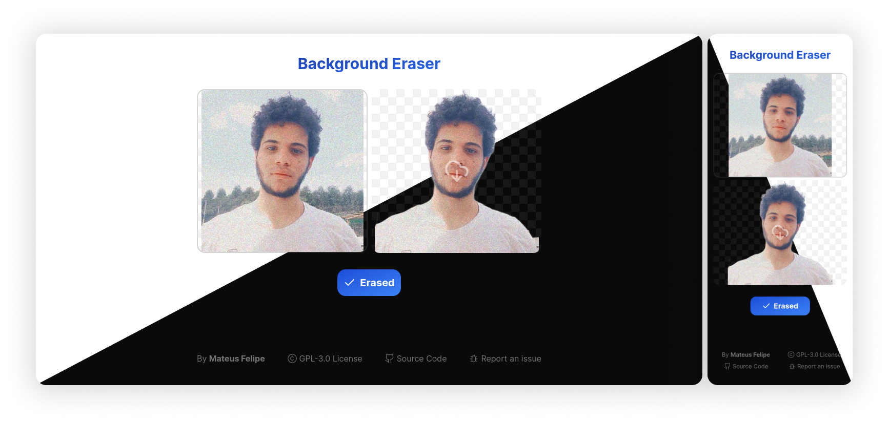

<div align="center">
<h1> Background Eraser</h1>

Simple tool to **erase background** of any images


</div>

<br>
<br>
<br>

## ✨ Additional Features

- Responsive
- Light/Dark colors
- SEO Optimized

## 🔧 Setup

> First of all you need to have already installed on your machine: [Node.js](https://nodejs.org) and [PNPM](https://pnpm.io).

### Development

**Install Packages**
```console
pnpm install
```

**Start Dev Server**
```console
pnpm dev
```
_Now go to http://localhost:3000_

### Production

**Install Packages**
```console
pnpm install
```

**Build Website**
```console
pnpm build
```

**Start Production Server**
```console
pnpm start
```
_Now go to http://localhost:3000_

<br>
<br>
<br>

<div align="center">


</div>